# SahamGue — IDX AI Trader

> AI-powered stock analysis platform for the Indonesia Stock Exchange (IDX)

[](CHANGELOG.md)
[](#tech-stack)
[](LICENSE)

---

## What Is This?

**SahamGue** (formerly IDX AI Trader) is a full-stack, production-grade SPA that helps retail investors analyze IDX-listed stocks using AI. It combines:

- **Real-time market data** ingested from IDX via a Python backend
- **AI-powered chart analysis** using Google Gemini vision and text models
- **Automated news pipeline** powered by Claude/Groq that scrapes, summarizes, and classifies financial news
- **Portfolio & trade journal** with PnL tracking
- **Subscription billing** via Xendit (Indonesian payment gateway)

This is a monorepo containing the React frontend, Python FastAPI core API, and Node.js news microservice — all sharing a single PostgreSQL database and deployed behind a Caddy reverse proxy.

---

## Table of Contents

- [Architecture](#architecture)
- [Tech Stack](#tech-stack)
- [Project Structure](#project-structure)
- [ERD — Database Schema](#erd--database-schema)
- [API Reference & Monitoring](#api-reference--monitoring)
- [Quick Start](#quick-start)
- [Environment Variables](#environment-variables)
- [Deployment](#deployment)
- [Contributing](#contributing)

---

## Architecture

```
┌─────────────────────────────────────────────────────┐
│                   Browser (React SPA)                │
│              React 19 + Vite  :3000                  │
└────────────────────────┬────────────────────────────┘
                         │  /api/*
                         ▼
┌─────────────────────────────────────────────────────┐
│              Caddy Gateway  :8080                    │
│   /api/news, /api/agent  ──►  Node.js  :3001        │
│   /api/*               ──►  FastAPI   :8000         │
└──────────────┬──────────────────────┬───────────────┘
               │                      │
   ┌───────────▼──────────┐  ┌───────▼────────────────┐
   │  Python FastAPI       │  │  Node.js Express        │
   │  Auth, Portfolio,     │  │  News Agent Pipeline    │
   │  Stocks, AI Proxy,    │  │  Groq + Claude + Scraper│
   │  Subscriptions, MFA   │  │  BullMQ + Redis Queue   │
   └───────────┬──────────┘  └────────────┬────────────┘
               │                           │
               └──────────┬────────────────┘
                          ▼
              ┌───────────────────────┐
              │     PostgreSQL DB      │
              │  SQLAlchemy (Python)   │
              │  Prisma (Node.js)      │
              └───────────────────────┘
```

**Data Provider Fallback Cascade** (frontend):

```
Live Mode:  Python Backend  →  Gemini AI  →  Mock Data (deterministic RNG)
Mock Mode:  Mock Data only  (VITE_APP_MODE=mock)
```

---

## Tech Stack

| Layer | Technology |
|---|---|
| Frontend | React 19, TypeScript, Vite, Tailwind CSS v3.4 |
| UI Components | Recharts (charts), Heroicons (icons) |
| Auth (frontend) | Clerk (OAuth + JWT) |
| Python Backend | FastAPI, SQLAlchemy (async), Alembic, Pydantic v2 |
| Node.js Backend | Express, Prisma, BullMQ, Swagger UI |
| Database | PostgreSQL (production), SQLite (dev) |
| Cache / Queue | Redis (Upstash in free-tier) |
| AI — Analysis | Google Gemini 2.0 Flash / 2.5 Pro |
| AI — News | Anthropic Claude (summarization), Groq (batch) |
| Payments | Xendit (QRIS, VA, e-wallet) |
| MFA | TOTP, Email OTP, WhatsApp OTP, SMS OTP |
| Reverse Proxy | Caddy (self-managed) / Vercel edge rewrites (free-tier) |
| Containerization | Docker Compose |

---

## Project Structure

```
idx-ai-trader/
│
├── index.html                  # SPA entry point
├── index.tsx                   # React root: Clerk + Theme + ErrorBoundary
├── App.tsx                     # Main layout, state-based routing, design tokens
├── types.ts                    # Global TypeScript interfaces
├── vite.config.ts              # Vite dev proxy config
├── tailwind.config.ts
│
├── components/                 # React UI components
│   ├── ChartAnalyzer.tsx       # AI vision tool (lazy-loaded)
│   ├── Backtester.tsx          # Strategy simulation (lazy-loaded)
│   ├── TradeJournal.tsx        # Trade log with PnL (lazy-loaded)
│   ├── Watchlist.tsx           # Price alert monitoring (lazy-loaded)
│   ├── AdminDashboard.tsx      # Ops monitor + admin tools (lazy-loaded)
│   ├── Chart.tsx               # Recharts wrapper
│   ├── Gauge.tsx               # SVG sentiment gauge
│   └── ...                     # Other UI components
│
├── services/                   # Frontend API clients
│   ├── dataProvider.ts         # Unified data access, MOCK/LIVE switching
│   ├── apiClient.ts            # apiFetch() — injects Clerk JWT bearer token
│   ├── authApi.ts              # Auth endpoints
│   ├── portfolioApi.ts         # Portfolio endpoints
│   ├── geminiService.ts        # Direct Gemini fallback
│   └── marketDataService.ts    # Mock data + math helpers (RSI, MACD)
│
├── hooks/                      # React custom hooks
│   ├── useMfa.ts
│   ├── useProfile.ts
│   └── usePortfolio.ts
│
├── pages/                      # Route-level page components
│
├── backend/
│   ├── app/                    # Python FastAPI
│   │   ├── main.py             # FastAPI app, middleware, router registration
│   │   ├── config.py           # All env settings, production validation
│   │   ├── database.py         # Async SQLAlchemy setup
│   │   ├── models/             # SQLAlchemy ORM models
│   │   │   ├── user.py         # User, RememberMeToken, PasswordResetToken
│   │   │   ├── profile.py      # NotificationPreference, UserSession
│   │   │   ├── portfolio.py    # PortfolioHolding, TradeJournalEntry, BrokerCash
│   │   │   ├── stock.py        # Stock, StockPrice, Watchlist
│   │   │   ├── subscription.py # Subscription, PaymentHistory
│   │   │   └── analysis.py     # AnalysisCache
│   │   ├── routers/            # FastAPI route handlers
│   │   │   ├── auth.py         # /api/auth/*
│   │   │   ├── profile.py      # /api/profile/*
│   │   │   ├── portfolio.py    # /api/portfolio/*
│   │   │   ├── stocks.py       # /api/stocks/*
│   │   │   ├── ai.py           # /api/ai/*
│   │   │   ├── subscription.py # /api/subscription/*
│   │   │   ├── webhook.py      # /api/webhooks/xendit/*
│   │   │   ├── admin_ops.py    # /api/admin/ops/*
│   │   │   └── internal.py     # /api/internal/* (service-to-service)
│   │   ├── schemas/            # Pydantic request/response models
│   │   └── services/           # Business logic, AI proxy, billing, MFA
│   │
│   ├── src/                    # Node.js Express (TypeScript)
│   │   ├── server.ts           # Express entry, BullMQ scheduler
│   │   ├── api/
│   │   │   ├── news/           # /api/news/* routes
│   │   │   └── admin/          # /api/news/agent/* admin routes
│   │   ├── agent/              # AI pipeline
│   │   │   ├── pipeline.ts     # Orchestrator
│   │   │   ├── scraper.ts      # RSS scraper
│   │   │   ├── claude.ts       # Claude summarization
│   │   │   ├── groq.ts         # Groq batch processing
│   │   │   └── dedup.ts        # Deduplication logic
│   │   ├── queue/              # BullMQ job queue + scheduler
│   │   ├── cache/              # Redis client
│   │   ├── middleware/         # Auth, rate limiter, error handler, logger
│   │   └── swagger/            # Swagger UI setup
│   │
│   ├── prisma/
│   │   ├── schema.prisma       # Prisma schema (news, agent, personalization)
│   │   └── seed.ts             # Database seeder
│   │
│   ├── alembic/                # Python DB migration scripts
│   ├── tests/                  # Python pytest tests
│   └── scripts/                # Dev/ops utility scripts
│
├── docker-compose.yml          # Dev stack
├── docker-compose.production.yml
├── Caddyfile                   # Reverse proxy config
├── vercel.json                 # Vercel edge rewrites (free-tier)
├── ARCHITECTURE.md             # Table ownership rules
├── DEPLOYMENT.md               # Deployment guide
├── PRODUCTION_RUNBOOK.md       # Key rotation, monitoring, DNS/TLS
└── CHANGELOG.md                # Version history
```

---

## ERD — Database Schema

The database is split across two ORM layers. **Python/SQLAlchemy** owns core user/business tables. **Prisma/Node.js** owns the news agent tables. They share the same PostgreSQL instance but must never cross-query — inter-service calls go through HTTP at `/api/internal/`.

```mermaid
erDiagram
    %% ─── PYTHON / SQLALCHEMY TABLES ───────────────────────────────────

    users {
        string id PK
        string email UK
        string name
        string password_hash
        string auth_provider
        string clerk_user_id UK
        string plan
        datetime plan_expires_at
        boolean mfa_enabled
        string mfa_type
        boolean is_admin
        string xendit_customer_id
        datetime created_at
        datetime deleted_at
    }

    remember_me_tokens {
        string id PK
        string user_id FK
        string token_hash UK
        datetime expires_at
    }

    password_reset_tokens {
        string id PK
        string user_id FK
        string token_hash UK
        datetime expires_at
        datetime used_at
    }

    notification_preferences {
        string id PK
        string user_id FK
        boolean price_alerts
        boolean news_alerts
        boolean portfolio_digest
        boolean email_enabled
        boolean push_enabled
    }

    user_sessions {
        string id PK
        string user_id FK
        string token_hash UK
        string user_agent
        string ip_address
        datetime expires_at
    }

    portfolio_holdings {
        bigint id PK
        string user_id FK
        string ticker
        int avg_buy_price
        int current_price
        int lot
        int unrealized_pnl
        numeric unrealized_pct
    }

    trade_journal_entries {
        bigint id PK
        string user_id FK
        string ticker
        string trade_type
        int entry_price
        int exit_price
        int lot
        string strategy
        int realized_pnl
        string status
        date trade_date
    }

    broker_cash {
        int id PK
        string user_id FK
        bigint cash_balance
        datetime last_updated
    }

    stocks {
        int id PK
        string ticker UK
        string name
        string sector
        float market_cap
    }

    stock_prices {
        int id PK
        string ticker
        datetime date
        float open
        float high
        float low
        float close
        float volume
    }

    watchlist {
        int id PK
        string ticker
        float target_price
        float stop_loss
        datetime added_at
    }

    subscriptions {
        string id PK
        string user_id FK
        string plan
        string billing_cycle
        string status
        int amount_idr
        datetime started_at
        datetime expires_at
        string xendit_invoice_id
    }

    payment_history {
        string id PK
        string user_id FK
        string subscription_id FK
        string xendit_invoice_id UK
        string plan
        int amount_idr
        string status
        string payment_method
        datetime paid_at
    }

    analysis_cache {
        int id PK
        string ticker
        string analysis_type
        json data
        string signal
        float confidence
        datetime expires_at
    }

    %% ─── PRISMA / NODE.JS TABLES ───────────────────────────────────────

    news_sources {
        string id PK
        string name UK
        string rssUrl UK
        boolean isActive
        datetime createdAt
    }

    news_items {
        string id PK
        string headline
        string summary
        string originalUrl UK
        string source
        datetime publishedAt
        string category
        string impactLevel
        string[] tickers
        int aiConfidence
        int views
        string agentRunId FK
        string sourceId FK
    }

    agent_runs {
        string id PK
        datetime startedAt
        datetime finishedAt
        string status
        string agentType
        int articlesFound
        int articlesSaved
        float estimatedCostUsd
        int groqTokensUsed
        int claudeInputTokens
        int claudeOutputTokens
    }

    user_personalizations {
        string id PK
        string userId UK
        string[] watchlistTickers
        string[] preferredSources
        datetime updatedAt
    }

    %% ─── RELATIONSHIPS ──────────────────────────────────────────────────

    users ||--o{ remember_me_tokens : "has"
    users ||--o{ password_reset_tokens : "has"
    users ||--|| notification_preferences : "has"
    users ||--o{ user_sessions : "has"
    users ||--o{ portfolio_holdings : "owns"
    users ||--o{ trade_journal_entries : "logs"
    users ||--o| broker_cash : "holds"
    users ||--o{ subscriptions : "subscribes"
    users ||--o{ payment_history : "pays"

    subscriptions ||--o{ payment_history : "generates"

    stock_prices }o--|| stocks : "belongs to"

    agent_runs ||--o{ news_items : "produces"
    news_sources ||--o{ news_items : "feeds"
```



> **Table ownership rule**: Python/SQLAlchemy owns all tables above the dashed line. Prisma/Node.js owns the news tables below it. Never cross-query via ORM — use `/api/internal/` HTTP calls between services.

---

## API Reference & Monitoring

### Python FastAPI — Interactive Docs

When the Python backend is running, FastAPI auto-generates fully interactive API documentation:

| Interface | URL | Notes |
|---|---|---|
| **Swagger UI** | `http://localhost:8000/docs` | Try endpoints directly in-browser |
| **ReDoc** | `http://localhost:8000/redoc` | Clean reference layout |
| **OpenAPI JSON** | `http://localhost:8000/openapi.json` | Import into Postman/Insomnia |

> In production, set `ENVIRONMENT=production` — FastAPI disables `/docs` and `/redoc` by default. To keep them accessible internally, add `app = FastAPI(docs_url="/docs")` only behind auth middleware.

### Node.js Express — Swagger UI

The news microservice exposes Swagger UI at:

| Interface | URL |
|---|---|
| **Swagger UI** | `http://localhost:3001/api-docs` |
| **Health Check** | `http://localhost:3001/health` |

### Admin Ops Dashboard

A built-in admin operations monitor is available in the app UI at **Admin → Ops Monitor** (requires `is_admin=true`). It surfaces:

- API traffic metrics (requests/min, error rate, p95 latency)
- Service health checks (DB, Redis, Clerk, Gemini, Xendit)
- Subscription and payment summaries
- AI token usage

The underlying API endpoint: `GET /api/admin/ops/overview`

### News Agent Dashboard

Agent run history (articles found, saved, cost, token usage) is available via:

```
GET /api/news/agent/status?limit=10      # requires admin JWT
```

### Recommended External Monitoring

For production deployments, layer these on top:

| Tool | Purpose | Setup |
|---|---|---|
| **Uptime Robot / BetterUptime** | Endpoint availability alerts | Ping `/health` and `/api/health` every 60s |
| **Sentry** | Error tracking (frontend + backend) | `pip install sentry-sdk`, `npm install @sentry/node` |
| **Grafana + Prometheus** | Metrics dashboards | Export `/metrics` via `prometheus-fastapi-instrumentator` |
| **Datadog / New Relic** | Full APM | Agent-based; good for production PostgreSQL + Redis |
| **PgAdmin / Supabase Studio** | Database queries | Connect to `DATABASE_URL` directly |
| **Prisma Studio** | Node.js DB tables | `cd backend && npm run db:studio` |
| **BullMQ Board** | Queue job monitoring | Add `bull-board` package to Node.js server |

#### Quick Prometheus setup for FastAPI

```bash
pip install prometheus-fastapi-instrumentator
```

```python
# backend/app/main.py
from prometheus_fastapi_instrumentator import Instrumentator
Instrumentator().instrument(app).expose(app)
# Metrics available at GET /metrics
```

---

## Quick Start

### Prerequisites

- Node.js 20+
- Python 3.11+
- PostgreSQL 15+ (or Docker)
- Redis (or Upstash free tier)

### 1. Clone & install

```bash
git clone <repo-url>
cd idx-ai-trader

# Frontend dependencies
npm install

# Python dependencies
cd backend
python -m venv .venv
.venv\Scripts\activate        # Windows
source .venv/bin/activate      # macOS/Linux
pip install -r requirements.txt

# Node.js news backend dependencies
npm install
```

### 2. Configure environment

```bash
# Frontend
cp .env.example .env.local

# Python backend
cp backend/.env.example backend/.env

# Node.js backend
cp backend/.env.example backend/.env  # same file, shared
```

Fill in the required values — see [Environment Variables](#environment-variables) below.

### 3. Database setup

```bash
# Python migrations
cd backend
alembic upgrade head

# Prisma schema (Node.js tables)
npm run db:migrate
npm run db:generate
npm run db:seed      # optional: seed news sources
```

### 4. Run locally

Open three terminals:

```bash
# Terminal 1 — Frontend (Vite dev server on :3000)
npm run dev

# Terminal 2 — Python API (:8000)
cd backend
.venv\Scripts\activate
uvicorn app.main:app --reload --host 0.0.0.0 --port 8000

# Terminal 3 — Node.js news backend (:3001)
cd backend
npm run dev
```

Visit `http://localhost:3000`. For a zero-network dev experience, set `VITE_APP_MODE=mock` in `.env.local`.

### 5. Docker (full stack)

```bash
docker-compose up --build -d
# App available at http://localhost:8080
```

---

## Environment Variables

### Frontend (`.env.local`)

| Variable | Required | Description |
|---|---|---|
| `VITE_CLERK_PUBLISHABLE_KEY` | Yes | Clerk publishable key (`pk_test_...`) |
| `VITE_API_URL` | Yes | `http://localhost:8080` (Caddy) or empty for Vite proxy |
| `VITE_APP_MODE` | No | `mock` for zero-network dev mode |

### Python Backend (`backend/.env`)

| Variable | Required | Description |
|---|---|---|
| `JWT_SECRET_KEY` | Yes | Min 32 chars — `python -c "import secrets; print(secrets.token_hex(32))"` |
| `MFA_ENCRYPTION_KEY` | Yes | Exactly 64 hex chars |
| `DATABASE_URL` | Yes | PostgreSQL URL (production) |
| `CLERK_SECRET_KEY` | Yes | Clerk secret key |
| `XENDIT_SECRET_KEY` | Yes | Xendit API key |
| `XENDIT_WEBHOOK_TOKEN` | Yes | Xendit webhook verification token |
| `GEMINI_API_KEY` | No | Google Gemini key (AI features disabled without it) |
| `REDIS_URL` | Prod | Required for OTP store and rate limiting |
| `SMTP_HOST` | No | Email delivery (OTP, password reset) |

### Node.js Backend (`backend/.env`)

| Variable | Required | Description |
|---|---|---|
| `DATABASE_URL` | Yes | Same PostgreSQL URL as Python backend |
| `REDIS_URL` | Yes | Upstash Redis URL (`rediss://...`) |
| `ANTHROPIC_API_KEY` | No | Claude (news summarization) |
| `GROQ_API_KEY` | No | Groq (batch news processing) |
| `CLERK_SECRET_KEY` | Yes | Clerk secret for JWT verification |
| `INTERNAL_SECRET` | Yes | Shared secret for `/api/internal/` calls |

See `backend/.env.free.example` for a free-tier config using Neon (PostgreSQL), Upstash (Redis), and Resend (email).

---

## Deployment

### Free Tier (Vercel + Render)

See [DEPLOYMENT.md](DEPLOYMENT.md) for the full guide. The short version:

| Service | Hosts |
|---|---|
| Vercel | React SPA frontend |
| Render | Python FastAPI backend |
| Render | Node.js news backend |
| Neon | PostgreSQL database |
| Upstash | Redis |
| Resend | Transactional email |

`vercel.json` contains edge rewrites that replace Caddy in this topology.

### Docker (Self-hosted)

```bash
docker compose -f docker-compose.production.yml up --build -d
```

Run the production preflight check before any deploy:

```bash
python scripts/production_preflight.py
python scripts/go_live_smoke_test.py --base-url https://your-domain.com
```

---

## API Endpoints Summary

### Python FastAPI (`/api/*`)

| Method | Path | Description |
|---|---|---|
| `POST` | `/api/auth/register` | Register with email/password |
| `POST` | `/api/auth/login` | Login |
| `POST` | `/api/auth/clerk/sync` | Sync Clerk user profile |
| `GET` | `/api/auth/me` | Current user |
| `GET` | `/api/profile` | User profile |
| `PATCH` | `/api/profile` | Update profile |
| `GET` | `/api/portfolio/summary` | Full portfolio summary |
| `POST` | `/api/portfolio/holdings` | Add holding |
| `GET` | `/api/portfolio/trades` | Trade journal |
| `POST` | `/api/portfolio/trades` | Log a trade |
| `GET` | `/api/stocks` | List all IDX stocks |
| `GET` | `/api/stocks/{ticker}/price` | Real-time price |
| `GET` | `/api/stocks/{ticker}/history` | Price history |
| `POST` | `/api/ai/analyze-stock` | Full AI stock analysis |
| `POST` | `/api/ai/chart-vision` | AI chart image analysis |
| `GET` | `/api/subscription/status` | Subscription status |
| `POST` | `/api/subscription/subscribe` | Create Xendit invoice |
| `POST` | `/api/webhooks/xendit/invoice` | Xendit payment webhook |
| `GET` | `/api/admin/ops/overview` | Admin ops dashboard |

Full interactive documentation at `http://localhost:8000/docs`.

### Node.js Express (`/api/news/*`)

| Method | Path | Description |
|---|---|---|
| `GET` | `/api/news/feed` | Paginated news feed (`?tab=hot\|latest\|critical\|popular`) |
| `GET` | `/api/news/personalized` | News filtered by user watchlist |
| `GET` | `/api/news/by-ticker/{ticker}` | News for a specific ticker |
| `POST` | `/api/news/{id}/views` | Increment view count |
| `POST` | `/api/news/agent/trigger` | Manually trigger news agent run |
| `GET` | `/api/news/agent/status` | Recent agent run statuses |
| `GET` | `/health` | Health check |

Full interactive documentation at `http://localhost:3001/api-docs`.

---

## Contributing

1. Fork and create a feature branch: `git checkout -b feat/your-feature`
2. Follow the table ownership rules in [ARCHITECTURE.md](ARCHITECTURE.md)
3. Run checks before committing: `npm run check` (frontend build + Node build + Python tests)
4. Ensure `python scripts/production_preflight.py` passes for any backend changes
5. Open a PR against `main`

---

## License

MIT — see [LICENSE](LICENSE) for details.
