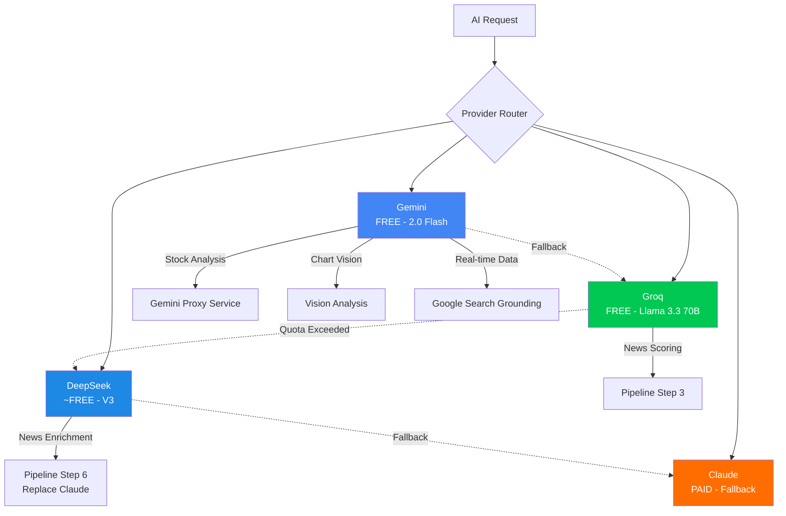

# AI Agent Gap Analysis & Free Provider Recommendations

## Current State — What You Already Have

Your project already has a solid AI agent architecture. Here's the inventory:

### ✅ Working AI Components

| Component | Location | Provider | Status |
|---|---|---|---|
| **News Agent Pipeline** | `backend/src/agent/pipeline.ts` | Groq (free) → Claude (paid) | ✅ Fully built |
| **RSS Scraper** | `backend/src/agent/scraper.ts` | N/A (no AI needed) | ✅ Working |
| **Groq Relevance Scorer** | `backend/src/agent/groq.ts` | Groq (llama-3.3-70b-versatile) | ✅ Free tier |
| **Claude Enrichment** | `backend/src/agent/claude.ts` | Anthropic (claude-sonnet-4-5) | ⚠️ Paid only |
| **Stock Analysis** | `backend/app/services/ai_analysis.py` | Gemini (gemini-2.0-flash) | ⚠️ Falls back to mock |
| **Real-time Price** | `backend/app/services/gemini_proxy_service.py` | Gemini (Google Search grounding) | ⚠️ Falls back to mock |
| **Chart Vision** | `backend/app/services/gemini_proxy_service.py` | Gemini Vision | ⚠️ Falls back to mock |
| **Stock News Fetch** | `backend/app/services/gemini_proxy_service.py` | Gemini (Google Search grounding) | ⚠️ Falls back to mock |
| **BullMQ Job Queue** | `backend/src/queue/` | Redis + BullMQ | ✅ Built |
| **Cron Scheduler** | `backend/src/queue/scheduler.ts` | node-cron | ✅ Built |

### ⚠️ Key Issue: `enable_ai_calls` is Locked to Production Only

Your Python config at [config.py](file:///c:/Users/kurni/OneDrive/Documents/idx-ai-trader%20(1)/backend/app/config.py#L168-L170):
```python
@property
def enable_ai_calls(self) -> bool:
    """Only enable AI calls in production to save credits."""
    return self.ENVIRONMENT == "production" and bool(self.GEMINI_API_KEY)
```
This means **all AI features return mock data** unless you're in production. With free providers, you can safely enable AI calls in development too.

---

## What You're Lacking

### 🔴 Critical Gaps

| Gap | Impact | Effort |
|---|---|---|
| **1. Claude enrichment has no free fallback** | News pipeline fails or produces basic data without paid Anthropic key | High |
| **2. Gemini API key is empty** | ALL Python-side AI features return mock/dummy data (stock analysis, real-time prices, chart vision, news) | High |
| **3. No multi-provider fallback system** | If one provider is down/over-quota, everything fails silently to mock | Medium |
| **4. No AI-powered stock signal generation** | `signals.py` uses pure technicals, no AI enhancement | Medium |
| **5. No AI chatbot / assistant** | Users can't ask natural language questions about stocks | Low (future) |

### 🟡 Nice-to-Have Gaps

| Gap | Description |
|---|---|
| **Structured output parsing** | Current JSON parsing is fragile (`JSON.parse` with no schema validation) |
| **Token/cost tracking dashboard** | `agent_runs` table tracks costs but no UI to view them |
| **Rate limiting per provider** | No circuit-breaker pattern if a free tier quota is exhausted |
| **Prompt versioning** | Prompts are hardcoded strings, no version tracking |

---

## Do You Need MCP Servers?

> **Short Answer: No.** ❌ You do NOT need MCP servers.

**MCP (Model Context Protocol)** is designed for connecting AI assistants (like Claude Desktop, Cursor, etc.) to external tools and data sources during *interactive development sessions*. It's meant for human-in-the-loop AI coding/browsing tools.

**Your use case is an automated backend pipeline** — your AI agents run as background jobs on a cron schedule, not interactively. You already have the right architecture:

| What You Have | What MCP Does | Verdict |
|---|---|---|
| Direct SDK calls (`groq-sdk`, `@anthropic-ai/sdk`, `google-genai`) | Provides a protocol for AI tools to call external services | Your direct SDK approach is simpler and faster |
| BullMQ + Redis job queue | N/A — MCP doesn't handle queues | Keep BullMQ |
| Cron scheduler for market hours | N/A | Keep node-cron |

**What you actually need:** A unified **AI provider abstraction layer** that lets you swap between free/paid providers easily.

---

## 🆓 Free AI Provider Recommendations

Here are the best free AI providers ranked by usefulness for your IDX AI Trader:

### Tier 1: Best Free Options (Use These Now)

| Provider | Free Tier | Model | Best For in Your App | Limits |
|---|---|---|---|---|
| **🥇 Groq** | ✅ Completely free | `llama-3.3-70b-versatile` | News relevance scoring (already using!) | 14,400 req/day, 6K tokens/min |
| **🥇 Google Gemini** | ✅ Free tier | `gemini-2.0-flash` | Stock analysis, chart vision, real-time data | 15 RPM, 1M tokens/day |
| **🥈 DeepSeek** | ✅ Very cheap ($0.14/M input) | `deepseek-chat` (V3) | News enrichment (replace Claude) | Pay-as-you-go, ~99% cheaper than Claude |
| **🥈 Groq + DeepSeek-R1** | ✅ Free on Groq | `deepseek-r1-distill-llama-70b` | Complex reasoning / stock analysis | Same Groq limits |

### Tier 2: Good Alternatives

| Provider | Free Tier | Model | Notes |
|---|---|---|---|
| **xAI Grok** | $25/month free credits (new users) | `grok-3-mini` | Good reasoning, but limited free tier |
| **Mistral** | Free tier available | `mistral-small-latest` | Good for structured JSON output |
| **Together AI** | $5 free credits | `meta-llama/Llama-3.3-70B` | Many open-source models available |
| **OpenRouter** | Pay-per-use (some free models) | Various | Aggregator — routes to cheapest provider |

### Tier 3: Future Paid Upgrade Path

| Provider | Model | Price | When to Upgrade |
|---|---|---|---|
| **Anthropic Claude** | `claude-sonnet-4-5` | $3/$15 per M tokens | When you need highest quality enrichment |
| **OpenAI** | `gpt-4o` | $2.50/$10 per M tokens | Alternative to Claude |
| **Google Gemini** | `gemini-2.5-pro` | $1.25/$10 per M tokens | Best value for complex reasoning |

---

## Proposed Architecture: Multi-Provider AI Service



---

## Proposed Changes

### Component 1: DeepSeek Integration (Replace Claude for FREE)

#### [NEW] [deepseek.ts](file:///c:/Users/kurni/OneDrive/Documents/idx-ai-trader%20(1)/backend/src/agent/deepseek.ts)

Create a DeepSeek enrichment service as a drop-in replacement for `claude.ts`. DeepSeek V3 is **~99% cheaper** than Claude and has excellent JSON output quality.

- Uses OpenAI-compatible API format (DeepSeek uses the same SDK interface)
- Same `enrichBatch()` function signature as `claude.ts`
- Same system prompt and output format
- Cost: ~$0.14/M input tokens vs Claude's $3/M (21x cheaper)

#### [MODIFY] [pipeline.ts](file:///c:/Users/kurni/OneDrive/Documents/idx-ai-trader%20(1)/backend/src/agent/pipeline.ts)

- Change import from `./claude` to `./deepseek` as default
- Add fallback: DeepSeek → Claude (if paid key is available)
- Add provider selection via `AI_ENRICHMENT_PROVIDER` env var

---

### Component 2: Gemini Free Tier Activation

#### [MODIFY] [config.py](file:///c:/Users/kurni/OneDrive/Documents/idx-ai-trader%20(1)/backend/app/config.py)

- Change `enable_ai_calls` to allow AI in development when API key is present
- Add `AI_PROVIDER_MODE` setting: `"free"` | `"paid"` | `"mock"`

```python
@property
def enable_ai_calls(self) -> bool:
    """Enable AI calls when API key exists (even in dev with free tier)."""
    return bool(self.GEMINI_API_KEY)
```

---

### Component 3: Provider Abstraction Layer (Node.js side)

#### [NEW] [provider.ts](file:///c:/Users/kurni/OneDrive/Documents/idx-ai-trader%20(1)/backend/src/agent/provider.ts)

A unified interface that routes AI requests to the best available provider:

```typescript
interface AIProvider {
  name: string;
  summarize(article: RawArticle): Promise<GroqResult | null>;
  enrich(batch: ArticleBatchInput[]): Promise<ClaudeBatchResult>;
  isAvailable(): boolean;
}
```

---

### Component 4: Environment Configuration

#### [MODIFY] [.env](file:///c:/Users/kurni/OneDrive/Documents/idx-ai-trader%20(1)/backend/.env)

Add new provider keys:

```env
# ── AI Provider Selection ─────────────────────────────────────
AI_ENRICHMENT_PROVIDER="deepseek"  # "deepseek" | "groq" | "claude"

# DeepSeek — V3 model (~$0.14/M input tokens, practically free)
DEEPSEEK_API_KEY="sk-xxxxxxxxxxxxxxxxxxxxxxxx"

# xAI Grok (optional, $25 free monthly credits)
XAI_API_KEY=""

# Google Gemini (free tier: 15 RPM, 1M tokens/day)
GEMINI_API_KEY="your-gemini-key-here"
```

---

### Component 5: Package Dependencies

#### [MODIFY] [package.json](file:///c:/Users/kurni/OneDrive/Documents/idx-ai-trader%20(1)/backend/package.json)

```diff
  "dependencies": {
+   "openai": "^4.70.0",        // DeepSeek uses OpenAI-compatible SDK
    "@anthropic-ai/sdk": "^0.37.0",
```

> [!TIP]
> DeepSeek, xAI Grok, and many other providers use the **OpenAI SDK** with a custom `baseURL`. One package covers multiple providers.

---

## Provider Setup Guide

### Step 1: Get Free API Keys

| Provider | Sign Up | Free Tier |
|---|---|---|
| **Groq** | [console.groq.com](https://console.groq.com) | Already have ✅ |
| **Google Gemini** | [aistudio.google.com](https://aistudio.google.com/apikey) | Free 15 RPM, 1M tokens/day |
| **DeepSeek** | [platform.deepseek.com](https://platform.deepseek.com) | $5 free credits on signup |
| **xAI Grok** | [console.x.ai](https://console.x.ai) | $25/month free credits |

### Step 2: Priority Order for Your App

1. **Get Gemini API key first** → Unlocks stock analysis, chart vision, real-time prices (all currently mocked)
2. **Get DeepSeek API key** → Replace Claude for news enrichment (99% cost savings)
3. **Keep Groq** → Already working for news relevance scoring
4. **Grok is optional** → Use as additional fallback

---

## Open Questions

> [!IMPORTANT]
> 1. **Which provider do you want me to integrate first?** I recommend starting with:
>    - **Gemini** (you already have the code, just need the API key)
>    - **DeepSeek** (to replace the Claude paid dependency)
>
> 2. **Do you want the fallback chain?** e.g., DeepSeek fails → try Groq → try Claude → return mock?
>
> 3. **Budget constraint**: Is DeepSeek's ~$0.14/M input token cost acceptable, or do you need strictly $0/month solutions?

---

## Verification Plan

### Automated Tests
- Run the news pipeline end-to-end with DeepSeek replacing Claude
- Verify JSON output schema matches existing `ClaudeEnrichedItem` interface
- Test Gemini proxy endpoints return real data instead of mock
- Verify fallback chain triggers correctly when a provider returns errors

### Manual Verification
- Start the system and check the news agent produces enriched articles
- Verify stock analysis page shows real AI insights instead of "AI analysis unavailable in development mode"
- Monitor token usage and costs via the `agent_runs` table
