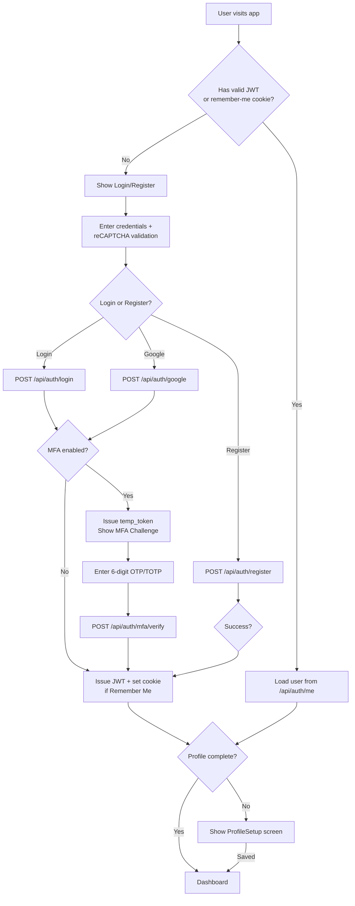

# Authentication Upgrade: MFA, Profile Management, Remember Me & Dev/Prod

Complete authentication system upgrade for IDX AI Trader — adding real user persistence, MFA (TOTP + OTP), profile onboarding, reCAPTCHA, "Remember Me" cookies, and zero-budget dev mocks.

## User Review Required

> [!IMPORTANT]
> **Google OAuth:** The current Google login is fully mocked. This plan replaces it with real server-side Google ID token verification using `google-auth`. You'll need a Google Cloud Console project with OAuth2 Client ID configured. For development, the mock still works without credentials.

> [!WARNING]
> **Database Migration:** This plan adds new tables (`users`, `remember_me_tokens`) to the existing SQLite DB. The existing [idx_trader.db](file:///c:/Users/kurni/OneDrive/Documents/idx-ai-trader%20%281%29/backend/idx_trader.db) will be auto-migrated via `Base.metadata.create_all()`. No data loss for existing `stocks`/`analysis_cache` tables, but a fresh DB may be cleanest.

> [!CAUTION]
> **reCAPTCHA Keys:** For dev, reCAPTCHA v2 uses Google's special test keys (always passes). For production, you must register at [Google reCAPTCHA](https://www.google.com/recaptcha/admin) and set real keys. The plan defaults to "invisible" reCAPTCHA v2.

---

## Proposed Changes

### Backend Models

#### [NEW] [user.py](file:///c:/Users/kurni/OneDrive/Documents/idx-ai-trader%20(1)/backend/app/models/user.py)

New SQLAlchemy models:

```python
# User model
class User(Base):
    __tablename__ = "users"
    id            = Column(String(36), primary_key=True, default=uuid4)
    email         = Column(String(255), unique=True, nullable=False, index=True)
    name          = Column(String(255), nullable=False)
    password_hash = Column(String(255), nullable=True)  # null for Google-only
    auth_provider = Column(String(20), default="local")  # "local" | "google"
    google_id     = Column(String(255), unique=True, nullable=True)
    
    # Profile
    profile_picture_url = Column(String(500), nullable=True)
    phone_number        = Column(String(30), nullable=True)
    profile_complete    = Column(Boolean, default=False)
    
    # MFA
    mfa_enabled = Column(Boolean, default=False)
    mfa_type    = Column(String(20), nullable=True)  # "totp" | "email_otp" | "whatsapp_otp"
    mfa_secret  = Column(String(255), nullable=True)  # TOTP base32 secret (encrypted)
    
    created_at = Column(DateTime, default=utcnow)
    updated_at = Column(DateTime, default=utcnow, onupdate=utcnow)

# Remember-me persistent token
class RememberMeToken(Base):
    __tablename__ = "remember_me_tokens"
    id         = Column(String(36), primary_key=True, default=uuid4)
    user_id    = Column(String(36), ForeignKey("users.id"), nullable=False)
    token_hash = Column(String(255), nullable=False, unique=True)
    expires_at = Column(DateTime, nullable=False)
    created_at = Column(DateTime, default=utcnow)
```

#### [MODIFY] [__init__.py](file:///c:/Users/kurni/OneDrive/Documents/idx-ai-trader%20(1)/backend/app/models/__init__.py)

Add imports for [User](file:///c:/Users/kurni/OneDrive/Documents/idx-ai-trader%20%281%29/types.ts#157-163) and `RememberMeToken`.

---

### Backend Auth Schemas

#### [NEW] [auth.py](file:///c:/Users/kurni/OneDrive/Documents/idx-ai-trader%20(1)/backend/app/schemas/auth.py)

Pydantic schemas for all auth operations:

| Schema | Purpose |
|--------|---------|
| `RegisterRequest` | email, name, password, recaptcha_token |
| `LoginRequest` | email, password, recaptcha_token, remember_me |
| `GoogleAuthRequest` | google_id_token, recaptcha_token |
| `MfaVerifyRequest` | temp_token, otp_code |
| `MfaSetupRequest` | mfa_type (totp/email_otp/whatsapp_otp) |
| `ProfileUpdateRequest` | name, phone_number, profile_picture_url |
| `AuthResponse` | access_token, user, mfa_required, temp_token |
| `UserResponse` | id, email, name, avatar, mfa_enabled, profile_complete |

---

### Backend Config Updates

#### [MODIFY] [config.py](file:///c:/Users/kurni/OneDrive/Documents/idx-ai-trader%20(1)/backend/app/config.py)

Add new settings with **sensible dev defaults**:

```python
# JWT
JWT_SECRET_KEY: str = "dev-secret-key-change-in-production"
JWT_ALGORITHM: str = "HS256"
JWT_ACCESS_TOKEN_EXPIRE_MINUTES: int = 30
JWT_REMEMBER_ME_EXPIRE_DAYS: int = 30

# reCAPTCHA (dev = Google test keys, always pass)
RECAPTCHA_SECRET_KEY: str = "6LeIxAcTAAAAAGG-vFI1TnRWxMZNFuojJ4WifJWe"
RECAPTCHA_ENABLED: bool = True

# Email / OTP
SMTP_HOST: str = ""
SMTP_PORT: int = 587
SMTP_USER: str = ""
SMTP_PASSWORD: str = ""
SMTP_FROM: str = "noreply@idxtrader.dev"
OTP_EXPIRE_MINUTES: int = 5

# Profile uploads
UPLOAD_DIR: str = "./uploads/avatars"
```

> Dev reCAPTCHA secret above is Google's official test key — always returns success.

---

### Backend Auth Services

#### [NEW] [auth_service.py](file:///c:/Users/kurni/OneDrive/Documents/idx-ai-trader%20(1)/backend/app/services/auth_service.py)

Core auth logic:

| Function | Description |
|----------|-------------|
| `hash_password(plain)` | bcrypt hash |
| `verify_password(plain, hash)` | bcrypt verify |
| `create_access_token(user_id, expires)` | JWT with `sub=user_id` |
| `create_temp_mfa_token(user_id)` | Short-lived JWT for MFA challenge |
| `decode_token(token)` | Validate + decode JWT |
| `get_current_user(token, db)` | FastAPI dependency — extract user from `Authorization: Bearer` |

#### [NEW] [mfa_service.py](file:///c:/Users/kurni/OneDrive/Documents/idx-ai-trader%20(1)/backend/app/services/mfa_service.py)

| Function | Description |
|----------|-------------|
| `generate_totp_secret()` | Generate base32 secret |
| `get_totp_qr_uri(secret, email)` | Generate `otpauth://` provisioning URI |
| `verify_totp(secret, code)` | Verify TOTP code using `pyotp` |
| `generate_otp()` | Generate 6-digit numeric OTP |
| `send_otp_email(email, code)` | Send via SMTP (dev: console log) |
| `send_otp_whatsapp(phone, code)` | Dev: console log. Prod: Meta Graph API |
| `verify_otp(stored, provided)` | Compare with expiry check |

#### [NEW] [recaptcha_service.py](file:///c:/Users/kurni/OneDrive/Documents/idx-ai-trader%20(1)/backend/app/services/recaptcha_service.py)

```python
async def verify_recaptcha(token: str) -> bool:
    """
    Dev: Uses Google test secret (always passes).
    Prod: POSTs to https://www.google.com/recaptcha/api/siteverify
    """
```

---

### Backend Auth Router

#### [NEW] [auth.py](file:///c:/Users/kurni/OneDrive/Documents/idx-ai-trader%20(1)/backend/app/routers/auth.py)

All endpoints prefixed with `/api/auth`:

| Endpoint | Method | Description |
|----------|--------|-------------|
| `/register` | POST | Create user, validate reCAPTCHA, hash password, return JWT |
| `/login` | POST | Validate reCAPTCHA, verify password, check MFA -> return JWT or temp_token |
| `/google` | POST | Verify Google ID token server-side, upsert user, check MFA |
| `/mfa/verify` | POST | Verify OTP/TOTP from temp_token, issue real JWT |
| `/mfa/setup` | POST | Enable TOTP (returns QR) or OTP type. Requires auth. |
| `/mfa/disable` | POST | Disable MFA. Requires auth. |
| `/me` | GET | Return current user profile. Requires auth. |
| `/profile` | PUT | Update name, phone, avatar. Mark `profile_complete=True`. |
| `/logout` | POST | Clear remember-me cookie |

#### [MODIFY] [main.py](file:///c:/Users/kurni/OneDrive/Documents/idx-ai-trader%20(1)/backend/app/main.py)

Add `app.include_router(auth.router, prefix="/api/auth", tags=["Auth"])`.

---

### Backend Dependencies

#### [MODIFY] [requirements.txt](file:///c:/Users/kurni/OneDrive/Documents/idx-ai-trader%20(1)/backend/requirements.txt)

Add:
```
PyJWT>=2.8.0
passlib[bcrypt]>=1.7.4
pyotp>=2.9.0
qrcode[pil]>=7.4.0
google-auth>=2.20.0
```

---

### Frontend Auth API

#### [NEW] [authApi.ts](file:///c:/Users/kurni/OneDrive/Documents/idx-ai-trader%20(1)/services/authApi.ts)

Functions to call all `/api/auth/*` endpoints, managing localStorage for JWT tokens.

---

### Frontend Auth Components

#### [MODIFY] [Auth.tsx](file:///c:/Users/kurni/OneDrive/Documents/idx-ai-trader%20(1)/components/Auth.tsx)

- Replace mock `setTimeout` with real API calls to `/api/auth/login`, `/api/auth/register`, `/api/auth/google`
- Add reCAPTCHA v2 invisible checkbox (using Google's free test site key `6LeIxAcTAAAAAJcZVRqyHh71UMIEGNQ_MXjiZKhI` for dev)
- Add "Remember Me" checkbox on login form
- Show error messages from API responses
- On MFA required, redirect to MFA verify step instead of completing login

#### [NEW] [ProfileSetup.tsx](file:///c:/Users/kurni/OneDrive/Documents/idx-ai-trader%20(1)/components/ProfileSetup.tsx)

Post-registration onboarding step: name, phone, avatar upload. Shown when `user.profile_complete === false`.

#### [NEW] [MfaSetup.tsx](file:///c:/Users/kurni/OneDrive/Documents/idx-ai-trader%20(1)/components/MfaSetup.tsx)

Settings page component to enable TOTP (show QR code) or OTP (email/WhatsApp).

#### [NEW] [MfaVerify.tsx](file:///c:/Users/kurni/OneDrive/Documents/idx-ai-trader%20(1)/components/MfaVerify.tsx)

Challenge screen shown during login when MFA is enabled: enter 6-digit code.

#### [MODIFY] [App.tsx](file:///c:/Users/kurni/OneDrive/Documents/idx-ai-trader%20(1)/App.tsx)

- Update auth flow: `not logged in -> login/register -> (MFA verify if needed) -> (profile setup if incomplete) -> dashboard`
- Replace localStorage user with JWT-based session
- Add "Settings" sidebar item linking to MFA setup

#### [MODIFY] [types.ts](file:///c:/Users/kurni/OneDrive/Documents/idx-ai-trader%20(1)/types.ts)

Update [User](file:///c:/Users/kurni/OneDrive/Documents/idx-ai-trader%20%281%29/types.ts#157-163) interface:
```typescript
export interface User {
  id: string;
  name: string;
  email: string;
  avatar?: string;
  phone_number?: string;
  mfa_enabled: boolean;
  mfa_type?: 'totp' | 'email_otp' | 'whatsapp_otp';
  profile_complete: boolean;
  auth_provider: 'local' | 'google';
}
```

---

### Dev/Prod Environment Guide

#### [MODIFY] [.env.example](file:///c:/Users/kurni/OneDrive/Documents/idx-ai-trader%20(1)/backend/.env.example)

Add all new auth environment variables with dev defaults.

#### [NEW] [AUTH_DEV_GUIDE.md](file:///c:/Users/kurni/OneDrive/Documents/idx-ai-trader%20(1)/backend/AUTH_DEV_GUIDE.md)

Comprehensive guide documenting:

| Feature | Dev (Free) | Production |
|---------|-----------|------------|
| **Email OTP** | Console log (printed to terminal) | SendGrid / Amazon SES |
| **WhatsApp OTP** | Console log | Meta Graph API (WhatsApp Business) |
| **reCAPTCHA** | Google test keys (always pass) | Real reCAPTCHA v2/v3 keys |
| **Google OAuth** | Mock mode (bypass verify) | Real Google Cloud OAuth Client ID |
| **Profile Avatar** | Local disk `./uploads/avatars/` | Cloud storage (S3/GCS) |
| **JWT Secret** | Hardcoded dev key | Cryptographically random 256-bit key |

---

## Authentication Flow



---

## Verification Plan

### Automated Tests (Backend)

No existing test suite was found in the project. I will create a basic test file to validate the core auth flow:

#### [NEW] [test_auth.py](file:///c:/Users/kurni/OneDrive/Documents/idx-ai-trader%20(1)/backend/test_auth.py)

Simple pytest tests using FastAPI's `TestClient`:

```bash
# Run from backend directory:
cd backend
pip install pytest httpx
python -m pytest test_auth.py -v
```

Tests will cover:
1. **Register** — creates user, returns JWT
2. **Login** — correct password returns JWT, wrong password returns 401
3. **MFA setup** — TOTP secret generation, QR URI format
4. **MFA verify** — correct TOTP code passes, wrong code fails
5. **Profile update** — updates name/phone, marks profile_complete
6. **Remember-me** — cookie is set when flag is true

### Manual Verification

Since this involves visual UI changes and interactive flows, manual testing is needed:

1. **Start backend**: `cd backend && python -m uvicorn app.main:app --reload`
2. **Start frontend**: `npm run dev`
3. **Register flow**: Create account -> verify redirected to Profile Setup -> fill in name/phone -> verify redirected to Dashboard
4. **Login flow**: Log out -> log in with credentials -> verify Dashboard loads
5. **MFA setup**: Go to Settings -> enable TOTP -> scan QR with Google Authenticator app -> verify code works
6. **MFA login**: Log out -> log in -> verify MFA challenge screen appears -> enter code -> verify Dashboard
7. **Remember Me**: Check "Remember Me" -> log in -> close browser -> reopen -> verify still logged in
8. **reCAPTCHA**: Verify captcha widget appears on login/register forms (will auto-pass in dev)
9. **OTP console log**: Enable email OTP -> trigger login -> check backend terminal for printed OTP code
10. **Google login**: Click "Continue with Google" -> verify flow works (mock in dev)

> [!TIP]
> For manual testing, I recommend having the backend terminal visible to see console-logged OTP codes during MFA testing.
