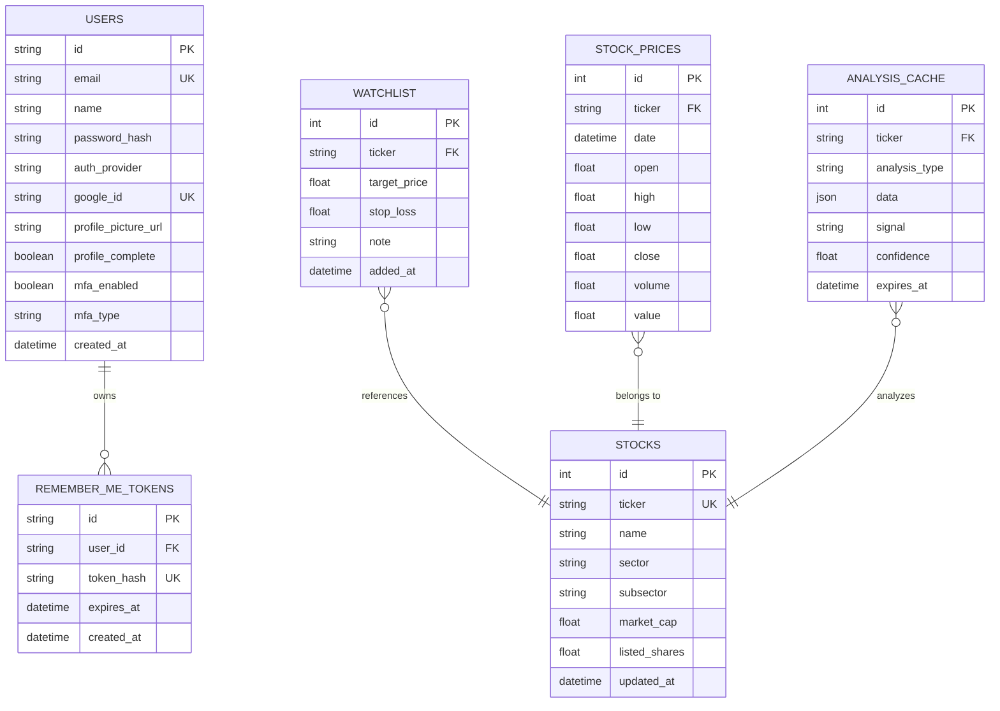
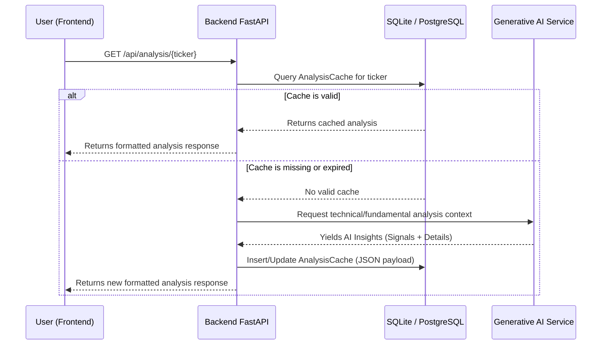
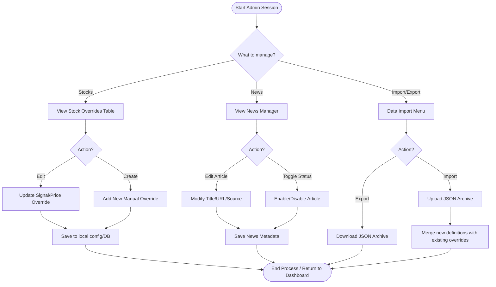

# IDX AI Trader - System Design Documentation

This document outlines the architecture and workflows of the IDX AI Trader system. 

## 1. Use Case Diagram

This diagram maps out the primary actors within the IDX AI Trader application and the major interactions they can perform.

```mermaid
usecaseDiagram
    actor "Registered User" as User
    actor "System Administrator" as Admin
    actor "AI & Market API" as ExternalAPI

    rectangle "IDX AI Trader System" {
        usecase "Login & Manage Profile" as UC1
        usecase "View Dashboard & Indices" as UC2
        usecase "Analyze Stock (Technicals/News)" as UC3
        usecase "Manage Watchlist" as UC4
        usecase "Run Backtesting" as UC5
        usecase "Log Trades (Journal)" as UC6
        
        usecase "Override Stock Data" as UC7
        usecase "Curate News Articles" as UC8
        usecase "Import/Export System Data" as UC9
        
        usecase "Fetch Market Prices" as UC10
        usecase "Generate AI Predictions" as UC11
    }

    User --> UC1
    User --> UC2
    User --> UC3
    User --> UC4
    User --> UC5
    User --> UC6

    Admin --> UC1
    Admin --> UC7
    Admin --> UC8
    Admin --> UC9
    
    ExternalAPI --> UC10
    ExternalAPI --> UC11
    
    UC3 ..> UC10 : uses
    UC3 ..> UC11 : uses
```

---

## 2. Entity Relationship Diagram (ERD)

The following ERD describes the backend database architecture, defining how users, tokens, stocks, prices, and analyses are related and stored.



---

## 3. Sequence Diagram (Stock Analysis Flow)

This sequence diagram illustrates the step-by-step process of how the system fetches, caches, and serves stock analysis to a user.



---

## 4. Flow Chart (Admin Data Override Process)

This flowchart dictates the decision-making process an administrator takes when managing overriding system data (news/stock data) to supplement automated API data.


